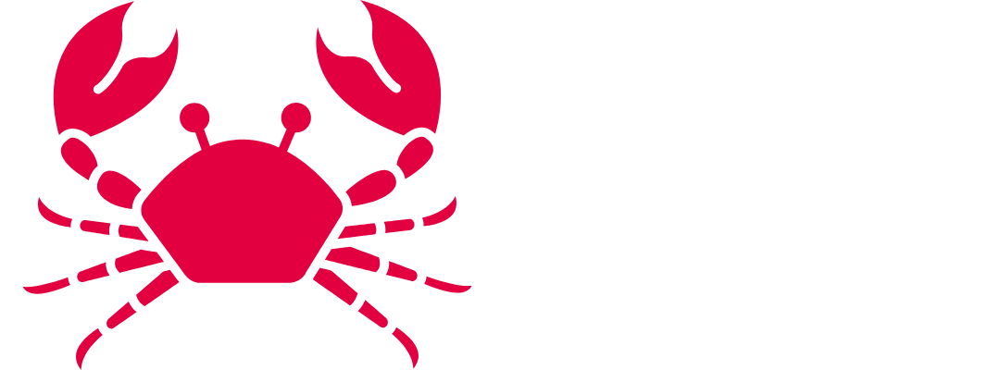
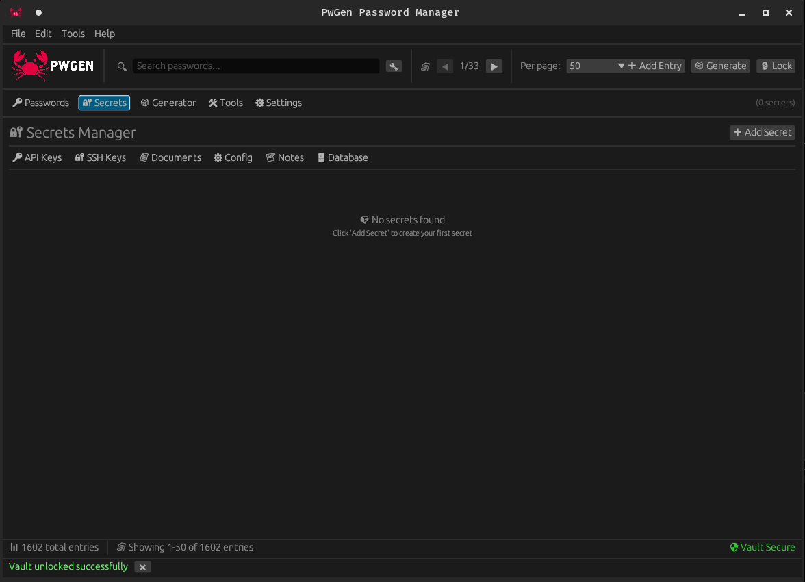
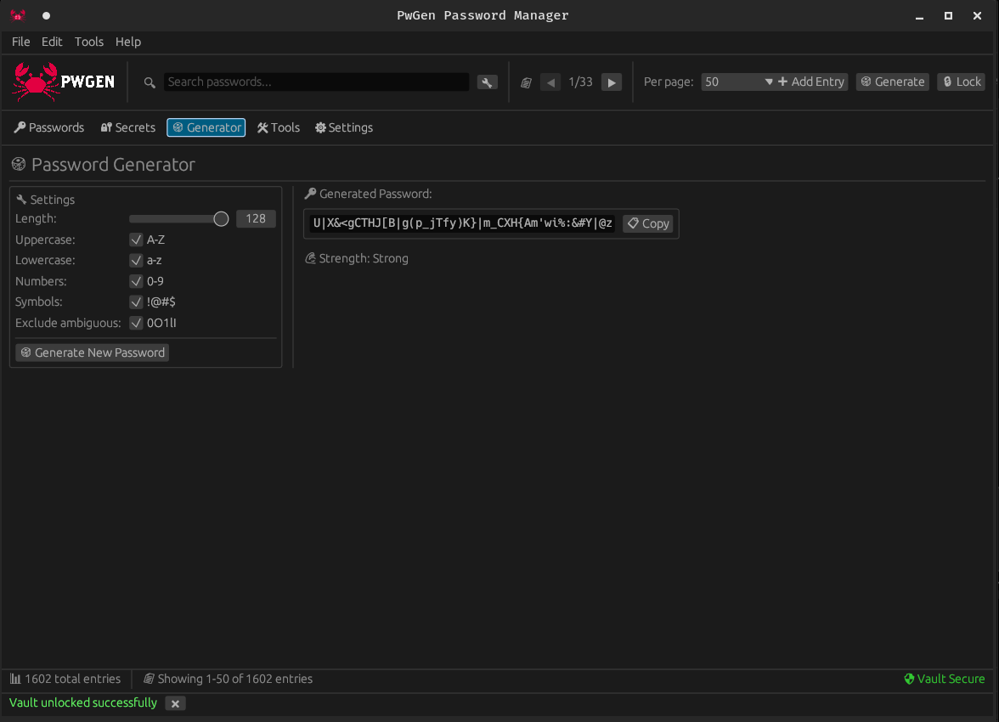
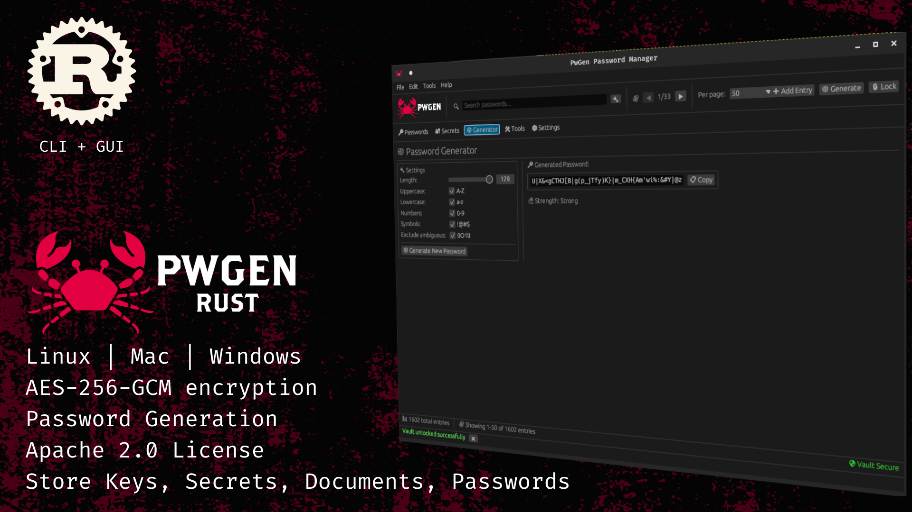

# 🦀 PwGen-rust - Advanced Password & Secrets Manager

<div align="center">



[](https://opensource.org/licenses/Apache-2.0)
[](https://www.rust-lang.org/)
[](https://github.com/HxHippy/PWGen/releases)
[](https://github.com/HxHippy/PWGen)
[](https://en.wikipedia.org/wiki/Galois/Counter_Mode)

**A modern, secure, and user-friendly password and secrets manager built in Rust**

[Features](#-features) • [Installation](#-installation) • [Usage](#-usage) • [Security](#-security) • [Contributing](#-contributing) • [Documentation](#-documentation)

</div>

## 📸 Screenshots

<div align="center">

### Desktop Application Interface


### Password Generator


### Application Banner


</div>

---

## 🚀 Overview

PwGen-rust is a comprehensive password and secrets management solution designed for modern cybersecurity needs. Built with Rust for performance and security, it provides enterprise-grade encryption while maintaining an intuitive user experience.

### 🎯 Why PwGen?

- **🔒 Military-Grade Security**: AES-256-GCM encryption with Argon2 key derivation
- **🎨 Modern UI**: Clean, responsive interface built with egui
- **🚀 High Performance**: Native Rust performance with optimized builds (30-40% smaller binaries)
- **🔧 Developer-Friendly**: CLI and GUI interfaces for all workflows
- **🌐 Cross-Platform**: Windows, macOS, and Linux support with flexible build options
- **📦 Self-Contained**: No cloud dependencies, your data stays local
- **🔄 Import/Export**: Seamless migration from other password managers
- **⚡ Optimized Builds**: Multiple build profiles for different deployment scenarios

---

## ✨ Features

### 🔐 Password Management
- **Secure Storage**: AES-256-GCM encrypted SQLite database
- **Smart Generation**: Customizable password generation with entropy analysis
- **Advanced Search**: Multi-field search with tags and filters
- **Bulk Operations**: Import/export from popular password managers
- **Auto-Fill Ready**: Organized for browser extension integration

### 🗝️ Secrets Management
- **API Keys & Tokens**: Secure storage with expiration tracking
- **SSH Keys**: Private/public key pair management with passphrase support
- **Secure Documents**: Encrypted file storage with checksum verification
- **Environment Variables**: Configuration and connection string management
- **Database Connections**: Secure credential storage for databases
- **Custom Secrets**: Flexible schema for any sensitive data

### 🛠️ Developer Tools
- **CLI Interface**: Full command-line functionality for automation
- **Browser Import**: Support for Chrome, Firefox, Safari, Edge, and more
- **Backup & Restore**: Encrypted backups with integrity verification
- **Audit Logging**: Comprehensive access and modification tracking
- **Template System**: Pre-configured templates for common services

### 🖥️ User Experience
- **Responsive Design**: Adaptive UI for different screen sizes
- **Tabbed Interface**: Organized navigation between different data types
- **Quick Actions**: One-click copy, edit, and delete operations
- **Dark/Light Theme**: Automatic theme detection and manual override
- **Keyboard Shortcuts**: Power-user friendly navigation

---

## 🛡️ Security

### Encryption Standards
- **Algorithm**: AES-256-GCM (Galois/Counter Mode)
- **Key Derivation**: Argon2 (memory-hard, side-channel resistant)
- **Salt Generation**: Cryptographically secure random salt per database
- **Memory Safety**: Rust's ownership model prevents memory vulnerabilities
- **Zero-Knowledge**: Master password never leaves your device

### Security Features
- **Secure Deletion**: Memory zeroization for sensitive data
- **Database Integrity**: SQLite with WAL mode and integrity checks
- **Input Validation**: Comprehensive sanitization and validation
- **Error Handling**: Secure error messages without information leakage
- **Audit Trail**: Complete logging of all access and modifications

### Security Verification
```bash
# Verify database encryption
sqlite3 ~/.config/pwgen/vault.db "SELECT hex(encrypted_password) FROM password_entries LIMIT 1;"

# Check file permissions
ls -la ~/.config/pwgen/
```

---

## 📦 Installation

### New in v1.2! 🎉
- **30-40% smaller binaries** with optimized builds
- **Flexible build options** for different platforms and requirements
- **Reduced Windows SDK dependencies** with minimal builds
- **Enhanced security** with modern cryptography (SHA-256 only)

### Quick Install (Recommended)

#### Linux (Snap Store - Approved! 🎉)
```bash
sudo snap install pwgen-rust
```

#### macOS
```bash
# Download the .dmg installer from GitHub releases
# https://github.com/HxHippy/PWGen/releases/latest
```

#### Windows
```powershell
# Download the NSIS installer from GitHub releases
# https://github.com/HxHippy/PWGen/releases/latest
```

### From Source

#### Prerequisites
- Rust 1.75+ ([Install Rust](https://rustup.rs/))
- Git

#### Linux Additional Dependencies
```bash
# Ubuntu/Debian
sudo apt install build-essential pkg-config libssl-dev libgtk-3-dev libxdo-dev

# Fedora/RHEL
sudo dnf install gcc gcc-c++ pkg-config openssl-devel gtk3-devel xdotool-devel

# Arch Linux
sudo pacman -S base-devel pkg-config openssl gtk3 xdotool
```

#### Build Instructions
```bash
# Clone the repository
git clone https://github.com/HxHippy/PWGen.git
cd PWGen

# Build release version (optimized for size)
cargo build --release

# Build minimal version (reduced Windows dependencies)
cargo build --release --no-default-features

# Build maximum size-optimized version
cargo build --profile min-size

# Install binaries
cargo install --path pwgen-cli
cargo install --path pwgen-gui

# Run the GUI
pwgen-gui

# Or use the CLI
pwgen-cli --help
```

### 🎛️ Build Options (v1.2)

#### Standard Build (Default)
```bash
cargo build --release
```
- **Features**: Full clipboard support, document compression
- **Platform**: Complete cross-platform compatibility
- **Size**: Standard optimized build

#### Minimal Build
```bash
cargo build --release --no-default-features
```
- **Features**: Core functionality only
- **Platform**: Reduced Windows SDK requirements
- **Size**: Smaller binary with fewer dependencies

#### Maximum Optimization
```bash
cargo build --profile min-size
```
- **Features**: All features with maximum size optimization
- **Platform**: All platforms
- **Size**: 30-40% smaller than standard builds

#### Custom Feature Selection
```bash
# Clipboard support only
cargo build --release --no-default-features --features clipboard

# Document compression only
cargo build --release --no-default-features --features document-compression

# Both features
cargo build --release --features "clipboard,document-compression"
```

### Package Managers

#### Snap Store (Linux)
```bash
sudo snap install pwgen-rust
```

#### Cargo (All Platforms)
```bash
cargo install --git https://github.com/HxHippy/PWGen
```

---

## 🎯 Usage

### GUI Application

Launch the desktop application:
```bash
pwgen-gui
```

**First Time Setup:**
1. Create a new vault with a strong master password
2. Import existing passwords (optional)
3. Start adding your credentials and secrets

**Daily Usage:**
- **Passwords Tab**: Manage website and application passwords
- **Secrets Tab**: Store API keys, SSH keys, and other sensitive data
- **Generator Tab**: Create secure passwords with custom rules
- **Tools Tab**: Import/export, backup/restore, and vault management

### CLI Application

```bash
# Create a new vault
pwgen-cli vault create

# Add a password entry
pwgen-cli password add --site github.com --username user --password "secure123"

# Generate a password
pwgen-cli generate --length 20 --symbols

# Search entries
pwgen-cli search "github"

# Create a backup
pwgen-cli backup create ./my-backup.pwgen

# View all commands
pwgen-cli --help
```

### Browser Integration

1. Install the PwGen browser extension (coming Q1 2026)
2. Enable the local API server: `pwgen-cli server start` (in development)
3. Connect the extension to your local vault
4. Enjoy seamless auto-fill capabilities

---

## 🏗️ Architecture

### Project Structure
```
pwgen/
├── pwgen-core/          # Core cryptography and storage logic
├── pwgen-cli/           # Command-line interface
├── pwgen-gui/           # Desktop GUI application
├── pwgen-extension/     # Browser extension (planned)
├── scripts/             # Installation and setup scripts
├── docs/                # Comprehensive documentation
└── ui/                  # Images, icons, and resources
```

### Technology Stack
- **Language**: Rust 2021 Edition
- **GUI Framework**: egui (immediate mode GUI)
- **Database**: SQLite with encryption
- **Crypto**: AES-256-GCM, Argon2 (secure, modern cryptography)
- **CLI**: clap for argument parsing
- **Async Runtime**: tokio (optimized features)
- **Serialization**: serde with JSON/TOML
- **Image Processing**: PNG decoder (lightweight replacement)
- **Optional Features**: Conditional compilation for platform-specific functionality

---

## 🔧 Configuration

### Default Locations
- **Linux**: `~/.config/pwgen/` or `~/.local/share/pwgen/`
- **macOS**: `~/Library/Application Support/pwgen/`
- **Windows**: `%LOCALAPPDATA%\pwgen\`

### Configuration File
```toml
# ~/.config/pwgen/config.toml
[database]
path = "vault.db"
backup_interval = "24h"
max_backups = 10

[security]
argon2_memory = 65536
argon2_iterations = 3
session_timeout = "15m"
auto_lock = true

[ui]
theme = "auto"  # auto, light, dark
font_size = 14
window_size = [1200, 800]

[cli]
editor = "vim"
pager = "less"
```

---

## 🌐 Browser Integration

Import passwords from popular browsers:

- Google Chrome / Chromium
- Mozilla Firefox
- Microsoft Edge
- Safari
- Opera
- Brave

```bash
# Import from Chrome
pwgen-cli import --browser chrome

# Import from Firefox with profile selection
pwgen-cli import --browser firefox --profile work
```

---

## 🤝 Contributing

We welcome contributions from the community! PwGen-rust is an open-source project that benefits from diverse perspectives and expertise.

### Quick Start
1. Fork the repository
2. Create a feature branch: `git checkout -b feature/amazing-feature`
3. Make your changes and add tests
4. Run the test suite: `cargo test`
5. Submit a pull request

### Development Setup
```bash
# Clone your fork
git clone https://github.com/HxHippy/PWGen.git
cd PWGen

# Install dependencies
cargo build

# Run tests
cargo test

# Run with debug logging
RUST_LOG=debug cargo run --bin pwgen-gui
```

### Contribution Guidelines
- Read our [Contributing Guide](CONTRIBUTING.md)
- Follow our [Code of Conduct](CODE_OF_CONDUCT.md)
- Check our [Security Policy](SECURITY.md)
- Review the [Development Documentation](docs/development.md)

---

## 📚 Documentation

### User Guides
- [Getting Started](docs/getting-started.md) - First steps with PwGen
- [User Manual](docs/user-manual.md) - Comprehensive usage guide
- [CLI Reference](docs/cli-reference.md) - Command-line interface documentation
- [Import/Export Guide](docs/import-export.md) - Migrating from other password managers

### Developer Documentation
- [API Reference](docs/api-reference.md) - Core library documentation
- [Architecture Guide](docs/architecture.md) - System design and components
- [Security Model](docs/security.md) - Cryptographic implementation details
- [Extension Development](docs/extensions.md) - Building browser extensions

### Tutorials
- [Advanced Password Policies](docs/tutorials/password-policies.md)
- [Automated Backups](docs/tutorials/automated-backups.md)
- [Team Workflows](docs/tutorials/team-workflows.md)
- [CI/CD Integration](docs/tutorials/cicd-integration.md)

---

## 🆘 Support

### Getting Help
- 📖 [Documentation](https://pwgenrust.dev/docs)
- 🐛 [Issue Tracker](https://github.com/HxHippy/PWGen/issues)
- 💬 [Discussions](https://github.com/HxHippy/PWGen/discussions)
- 📧 [Security Issues](mailto:security@pwgenrust.dev)

### Community
- 🐦 Follow [@HxHippy](https://x.com/HxHippy) on X/Twitter
- 🌐 Visit [HxHippy.com](https://hxhippy.com)
- 💼 [Kief Studio](https://kief.studio) - AI Integration & Technology Consulting
- 🔍 [TRaViS](https://travisasm.com) - AI-Powered EASM without asset caps

---

## 🙏 Acknowledgments

### Powered By
- **[TRaViS](https://travisasm.com)** - Threat Reconnaissance And Vulnerability Identification System
- **[Kief Studio](https://kief.studio)** - AI Integration and Technology Consulting Company
- **[HxHippy](https://hxhippy.com)** - [@HxHippy](https://x.com/HxHippy) on X/Twitter

### Built With
- [Rust](https://www.rust-lang.org/) - Systems programming language
- [egui](https://github.com/emilk/egui) - Immediate mode GUI framework
- [SQLite](https://www.sqlite.org/) - Self-contained SQL database engine
- [ring](https://github.com/briansmith/ring) - Cryptographic primitives
- [tokio](https://tokio.rs/) - Asynchronous runtime

### Special Thanks
- The Rust community for excellent tooling and libraries
- Security researchers and auditors who help keep PwGen secure
- All contributors who make this project better
- Open source projects that inspired PwGen's design

---

## 🗺️ Roadmap

### Completed ✅
- [x] Core encryption and storage (AES-256-GCM)
- [x] Password generation with full customization
- [x] CLI interface with comprehensive commands
- [x] Cross-platform GUI (egui-based)
- [x] Search and filtering with tags
- [x] Backup and restore functionality
- [x] Browser password import (Chrome, Firefox, Safari, Edge, Opera, Brave)
- [x] SSH key and API token management
- [x] Secure document storage
- [x] Advanced secrets management
- [x] Responsive UI design
- [x] Cross-platform installers
- [x] **v1.2**: Build optimization with 30-40% smaller binaries
- [x] **v1.2**: Conditional compilation for platform-specific features
- [x] **v1.2**: Enhanced security with modern cryptography (SHA-256 only)
- [x] **v1.2**: Flexible build profiles for different deployment scenarios
- [x] **v1.2**: Reduced Windows SDK requirements

### Near-term (Q1 2026) 🚧
- [ ] Mobile apps (iOS/Android)
- [ ] Browser extensions
- [ ] API server for integrations
- [ ] TOTP/2FA integration

### Medium-term (Q3 2026) 📋
- [ ] Cloud sync with end-to-end encryption
- [ ] Hardware security key support
- [ ] Team collaboration features

### Long-term (2027+) 🔮
- [ ] Advanced audit features
- [ ] Enterprise SSO integration
- [ ] Post-quantum cryptography

---

## 📄 License

This project is licensed under the Apache License 2.0 - see the [LICENSE](LICENSE) file for details.

```
Copyright 2025 HxHippy, Kief Studio, TRaViS

Licensed under the Apache License, Version 2.0 (the "License");
you may not use this file except in compliance with the License.
You may obtain a copy of the License at

    http://www.apache.org/licenses/LICENSE-2.0

Unless required by applicable law or agreed to in writing, software
distributed under the License is distributed on an "AS IS" BASIS,
WITHOUT WARRANTIES OR CONDITIONS OF ANY KIND, either express or implied.
See the License for the specific language governing permissions and
limitations under the License.
```

---

<div align="center">

**[⬆ Back to Top](#-pwgen---advanced-password--secrets-manager)**

Made with 🦀 and ❤️ by the PwGen team

</div>